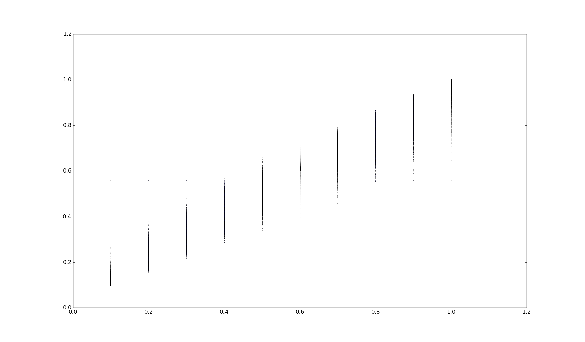
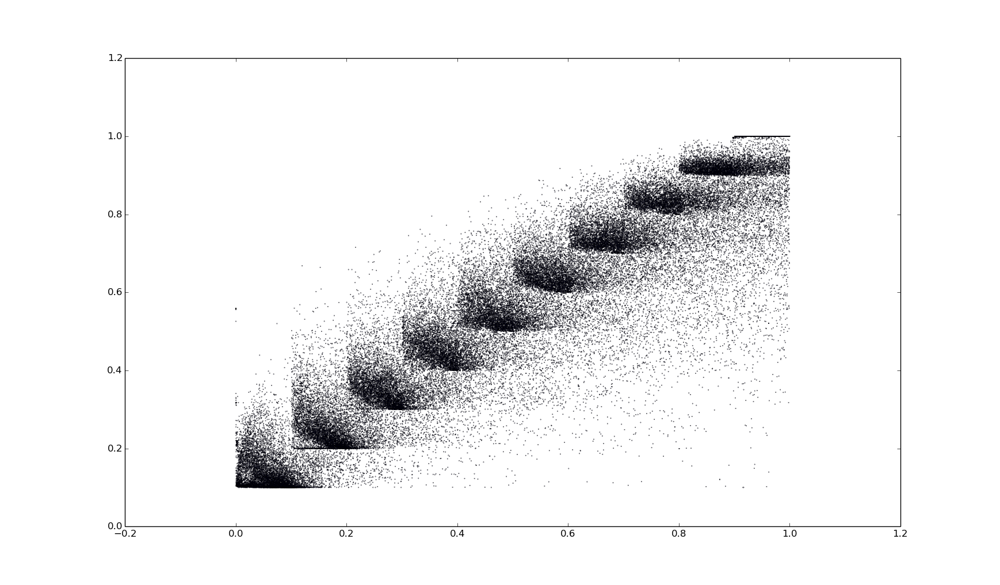
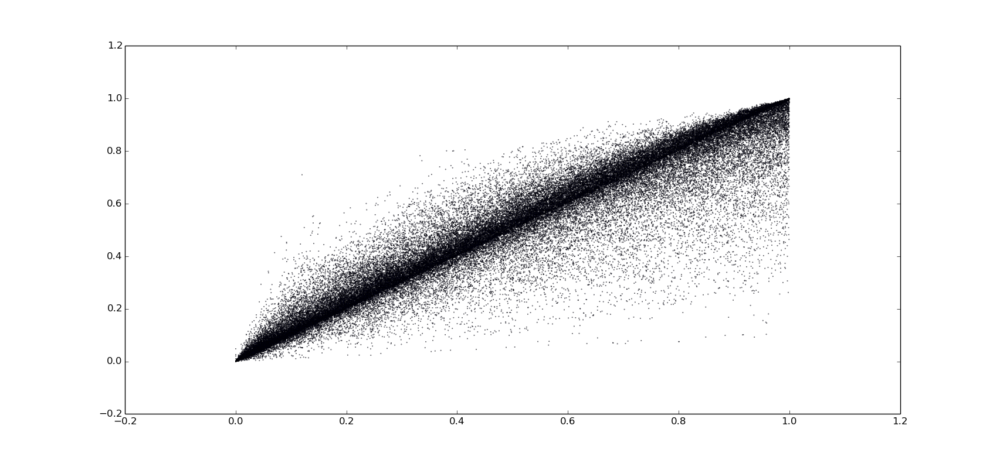

# Reference
*Investigating Haze-relevant Features in A Learning Framework for Image Dehazing*

# Some Results
> * training  transmission with RF result(using uniform transmission value in synthetic images )

> * testing  transmission with RF result(using uniform transmission value in synthetic images )

> * training  transmission with RF result(using random transmission value in synthetic images )

> * testing  transmission with RF result(using uniform transmission value in synthetic images )

